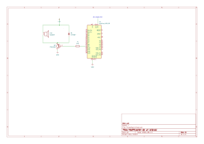

# Mi-camino-al-firmware
Proyectos personales de electrónica y firmware. Estudiante de Ingeniería Electrónica en la UTP Pereira. Aprendiendo desde cero hasta RISC-V. 

## Proyecto 01: Driver de Potencia para Altavoz (Transistor 2N2222)

Este proyecto demuestra cómo conmutar una carga inductiva de mayor corriente (un altavoz/bafle) utilizando un microcontrolador y un transistor BJT en la región de saturación.

### 1. Etapas del Sistema

*   **Generación de Señal:** El microcontrolador genera una onda cuadrada o señal PWM a una frecuencia audible desde un pin digital. Los pines de un ATmega328P están limitados a 40 mA, por lo que no pueden excitar el altavoz directamente.
*   **Conmutación (2N2222):** Un transistor NPN actúa como interruptor. Una pequeña corriente de base ($I_B$) satura el transistor ($V_{CE(sat)} \approx 0.2V$), permitiendo que fluya una corriente de colector ($I_C$) mayor desde una fuente externa hacia el altavoz.
*   **Protección (Diodo Flyback):** La bobina del altavoz es una carga inductiva. Al cortar la corriente abruptamente, el colapso del campo magnético genera un pico de tensión inverso ($V = -L \frac{di}{dt}$) que puede destruir el transistor. Un diodo 1N4007 en antiparalelo absorbe este transitorio.
*   **Alimentación Aislada:** La potencia del altavoz proviene de una fuente independiente, evitando caídas de tensión y ruido electromagnético en la lógica digital del microcontrolador.

### 2. Esquema Eléctrico



### 3. Código Fuente (C)

```c
const int pinAudio = 9;

void setup() {
  pinMode(pinAudio, OUTPUT);
  Serial.begin(9600);
  Serial.println("Amplificador listo");
}

void loop() {
  // Sirena
  for (int f = 200; f <= 800; f += 10) {
    tone(pinAudio, f);
    delay(10);
  }
  for (int f = 800; f >= 200; f -= 10) {
    tone(pinAudio, f);
    delay(10);
  }
  
  // Tres notas
  tone(pinAudio, 440); delay(400);
  tone(pinAudio, 554); delay(400);
  tone(pinAudio, 659); delay(600);
  
  noTone(pinAudio);
  delay(2000);
}
